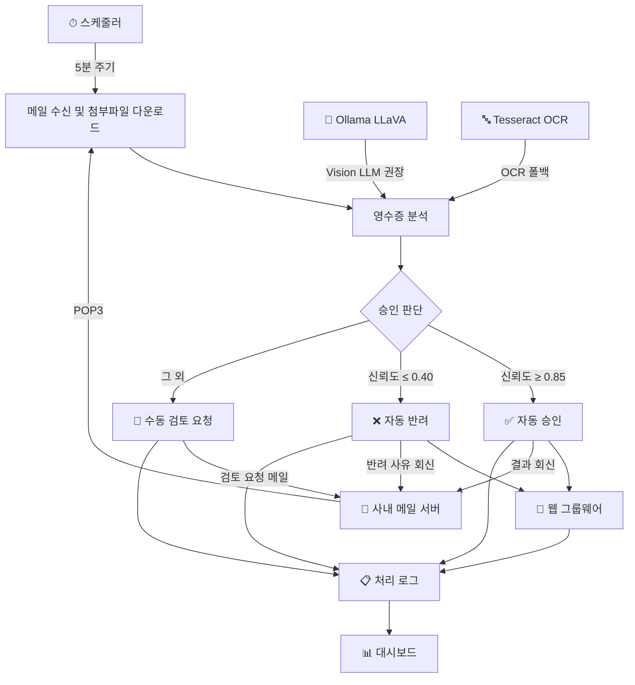

# 영수증 자동 검토 결재 시스템 (Receipt Auto-Review System)

오픈소스 기반으로 구축하는 사내 경비 결재 영수증 자동 검토 시스템.  
상용 RPA 도구 없이 Python + 로컬 LLM으로 노트북 한 대에서 운영 가능.

---

## 구현 현황

> 최종 업데이트: 2026-03-14

| 파일 | 역할 | 상태 |
|------|------|------|
| `engine/mail_client.py` | POP3 수신, 첨부파일 다운로드, SMTP 결과 발송 | ✅ 완료 |
| `engine/receipt_analyzer.py` | OCR(pytesseract) 기반 분석 — 방법 A | ✅ 완료 |
| `engine/llm_reviewer.py` | Ollama LLaVA 로컬 LLM 분석 — 방법 B (권장) | ✅ 완료 |
| `engine/approval_engine.py` | 신뢰도 기반 승인/반려/수동검토 판단 | ✅ 완료 |
| `engine/groupware_automation.py` | Playwright 그룹웨어 자동화 | ✅ 완료 |
| `bot.py` | 전체 파이프라인 통합 (`python bot.py`로 1회 실행) | ✅ 완료 |
| `scheduler.py` | 5분 주기 자동 실행 (`python scheduler.py`) | ✅ 완료 |
| `dashboard.py` | Streamlit 모니터링 대시보드 | ✅ 완료 |
| `simulation.py` | 실서버 없이 브라우저에서 파이프라인 시뮬레이션 | ✅ 완료 |

### 실제 환경 적용 전 필수 작업

1. `config.yaml` 작성 (`config.yaml.example` 복사 후 사내 메일/그룹웨어 정보 입력)
2. Ollama 설치 + `ollama pull llava:7b` (또는 13b)
3. `groupware_automation.py`의 버튼 셀렉터를 실제 그룹웨어 DOM에 맞게 수정 (Playwright codegen 활용)
4. 초기 2~4주는 `auto_approve_threshold: 0.95`로 높게 잡아 대부분 수동검토로 운영

---

## 1. 프로젝트 개요

### 배경

- 외부 Tool(상용 RPA) 사용이 어려운 사내 환경
- 웹/윈도우 환경에서 마우스 클릭, 파일 처리 등 시나리오 자동화 필요
- 노트북 1대에서 구현 가능한 수준

### 자동화 대상 시나리오

1. 수신된 결재 합의 이메일에서 첨부 영수증 다운로드
2. 영수증 이미지를 분석하여 결재 목적과의 일치 여부 판단
3. 일치 시 → 결재 승인 처리
4. 불일치 시 → 틀린 내용을 기록하여 반려 처리

### 사내 환경 조건

| 항목 | 상태 |
|------|------|
| 메일 시스템 | 회사 자체 메일 (POP3 / SMTP 사용 가능) |
| 그룹웨어 | 웹 기반 (Playwright로 자동화) |
| 네트워크 | 외부 API 호출 제한 → 로컬 LLM 사용 |

---

## 2. 시스템 아키텍처



---

## 3. 기술 스택

### 핵심 라이브러리

| 영역 | 라이브러리 | 용도 |
|------|-----------|------|
| 메일 수신 | `poplib` (표준 라이브러리) | POP3로 결재 이메일 가져오기 |
| 메일 발송 | `smtplib` (표준 라이브러리) | SMTP로 승인/반려 결과 회신 |
| 웹 자동화 | `playwright` | 그룹웨어 결재 처리 (승인/반려 클릭) |
| 영수증 분석 (방법 A) | `pytesseract` + `Pillow` | OCR 텍스트 추출 + 규칙 기반 검증 |
| 영수증 분석 (방법 B) | `ollama` + `LLaVA` | 로컬 Vision LLM으로 이미지 직접 분석 |
| 윈도우 자동화 | `pywinauto` | Windows 네이티브 UI 제어 |
| 좌표 기반 제어 | `pyautogui` | pywinauto 인식 불가 시 폴백 |
| 파일 처리 | `openpyxl`, `python-docx`, `PyPDF2` | Excel, Word, PDF 처리 |
| 스케줄링 | `APScheduler` | 주기적 자동 실행 |
| 대시보드 | `streamlit` | 실행 이력/성공/실패 모니터링 |

### 영수증 분석 방법 비교

| 구분 | 방법 A: OCR + 규칙 | 방법 B: 로컬 LLM (권장) |
|------|-------------------|----------------------|
| 정확도 | 영수증 품질에 좌우됨 | 맥락 이해 가능, 훨씬 정확 |
| 속도 | 빠름 (1~2초) | 7b: 10~30초 / 13b: 30~60초 |
| 리소스 | CPU만으로 충분 | GPU 권장 (없으면 7b CPU 가능) |
| 유연성 | 새 규칙마다 코드 수정 | 프롬프트만 수정 |
| 권장 상황 | 영수증 양식이 정형화된 경우 | 다양한 형태의 영수증 처리 |

---

## 4. 프로젝트 구조

```
receipt-check/
├── README.md
├── config.yaml.example         # 설정 템플릿 (config.yaml로 복사 후 수정)
├── requirements.txt
│
├── engine/                     # 핵심 엔진
│   ├── __init__.py
│   ├── mail_client.py          # POP3 수신 + SMTP 발송
│   ├── receipt_analyzer.py     # OCR 기반 영수증 분석 (방법 A)
│   ├── llm_reviewer.py         # 로컬 LLM 기반 분석 (방법 B)
│   ├── approval_engine.py      # 승인/반려 판단 로직
│   └── groupware_automation.py # Playwright 그룹웨어 자동화
│
├── bot.py                      # 전체 파이프라인 통합 실행
├── scheduler.py                # APScheduler 주기 실행
├── dashboard.py                # Streamlit 모니터링 대시보드
├── simulation.py               # 웹 자동 시뮬레이션 모드
│
├── logs/                       # 실행 로그 (JSON)
│   └── screenshots/            # 그룹웨어 처리 스크린샷 (감사 추적)
├── receipts/                   # 다운로드된 영수증 파일
└── processed_mails.json        # POP3 중복 처리 방지용 이력
```

---

## 5. 모듈별 상세 설계

### 5.1 메일 클라이언트 (`engine/mail_client.py`)

**POP3 수신:**
- `poplib.POP3_SSL`로 메일 서버 접속
- 제목에 "결재 합의" 키워드가 포함된 메일 필터링
- 첨부파일 중 이미지/PDF만 선별 다운로드 (jpg, png, pdf, tiff)
- `Message-ID` 또는 헤더 해시 기반으로 메일 고유 식별

**POP3 운영 주의사항:**
- POP3는 서버에 "읽음" 상태를 남기지 않음
- `processed_mails.json`으로 로컬에서 처리 이력을 관리하여 중복 방지
- 이 파일이 유실되면 과거 메일을 재처리할 수 있으므로 백업 필수
- 장기 운영 시 SQLite 전환 권장

**SMTP 발송:**
- 처리 결과(승인/반려/수동검토)를 원래 발신자에게 회신
- 제목에 `[승인]`, `[반려]` 등의 태그 자동 추가

### 5.2 영수증 분석기

#### 방법 A: OCR + 규칙 기반 (`engine/receipt_analyzer.py`)

- `pytesseract`로 한국어+영어 OCR 수행 (`lang="kor+eng"`)
- 정규식으로 금액, 날짜, 상호명 추출
- 카테고리별 키워드 매핑으로 영수증 분류:
  - 식비: 식당, 카페, 커피, 배달 등
  - 교통비: 택시, 주유, 주차, KTX 등
  - 사무용품: 문구, 복사, 프린트 등
  - 접대비: 접대, 회식, 거래처 등
  - 출장비: 호텔, 숙박, 항공 등

#### 방법 B: 로컬 LLM (`engine/llm_reviewer.py`) — 권장

- **Ollama + LLaVA** 조합으로 영수증 이미지를 직접 분석
- 이메일 본문의 결재 목적과 영수증 내용을 비교하여 일치 여부 판단
- JSON 형태로 구조화된 분석 결과 반환:
  - 상호명, 날짜, 금액, 구매 항목
  - 영수증 카테고리
  - 목적 일치 여부 + 신뢰도 (0.0~1.0)
  - 불일치 사항 목록
  - 판단 근거

**Ollama 설치:**
```bash
# Ollama 설치 후
ollama pull llava:13b    # GPU 16GB+ 권장
ollama pull llava:7b     # GPU 8GB 또는 CPU (느리지만 동작)
```

### 5.3 승인/반려 판단 엔진 (`engine/approval_engine.py`)

신뢰도 기반 3단계 판단:

| 구간 | 조건 | 처리 |
|------|------|------|
| 자동 승인 | `matches_purpose=True` AND `confidence ≥ 0.85` | 그룹웨어에서 승인 처리 |
| 자동 반려 | `matches_purpose=False` OR `confidence ≤ 0.4` | 불일치 사유와 함께 반려 |
| 수동 검토 | 그 외 (0.4 < confidence < 0.85) | 담당자에게 검토 요청 알림 |

> **초기 도입 시에는 임계값을 높게 잡아서 대부분 수동 검토로 돌리고,
> 정확도가 안정되면 점진적으로 자동 처리 비율을 높일 것.**

### 5.4 그룹웨어 자동화 (`engine/groupware_automation.py`)

- `playwright`로 웹 그룹웨어에 로그인
- 결재 문서 페이지로 이동하여 승인/반려 버튼 클릭
- 검토 의견(comment)을 텍스트 필드에 입력
- 처리 완료 후 스크린샷 저장 (감사 추적용)
- 개발 중에는 `headless=False`로 화면을 보며 작업, 운영 시 `headless=True`로 전환

---

## 6. 설정

```yaml
# config.yaml
mail:
  pop_server: "mail.yourcompany.com"
  pop_port: 995
  smtp_server: "mail.yourcompany.com"
  smtp_port: 587
  user: "your_id@company.com"
  password: ""        # 환경변수 또는 keyring 사용 권장
  download_dir: "./receipts"

groupware_url: "https://gw.yourcompany.com"
credentials:
  id: "your_gw_id"
  pw: ""              # keyring 사용 권장

llm:
  base_url: "http://localhost:11434"
  model: "llava:13b"  # 또는 llava:7b

scheduler:
  interval_minutes: 5
```

> **보안 주의:** 비밀번호는 코드나 설정 파일에 하드코딩하지 말 것.  
> `keyring` 라이브러리 또는 환경변수(`os.environ`)를 사용할 것.

---

## 7. 설치 및 실행

```bash
# 1. 저장소 클론
git clone https://github.com/chanwookkim79/receipt-check.git
cd receipt-check

# 2. 의존성 설치
pip install -r requirements.txt

# 3. Playwright 브라우저 설치
python -m playwright install chromium

# 4. Tesseract OCR 설치 (방법 A 사용 시)
#    Windows: https://github.com/UB-Mannheim/tesseract/wiki
#    설치 후 PATH에 추가 또는 코드에서 경로 지정

# 5. Ollama + LLaVA 설치 (방법 B 사용 시)
#    https://ollama.com 에서 Ollama 설치
ollama pull llava:13b

# 6. 설정 파일 수정
cp config.yaml.example config.yaml
# config.yaml을 사내 환경에 맞게 편집

# 7. 시뮬레이션으로 먼저 체험 (실서버 불필요)
python -m streamlit run simulation.py

# 8. 단일 실행 (실제 환경 테스트)
python bot.py

# 9. 스케줄러로 주기 실행
python scheduler.py

# 10. 모니터링 대시보드 실행
python -m streamlit run dashboard.py
```

---

## 8. 시뮬레이션 모드

실제 메일서버 / 그룹웨어 / LLM 없이 브라우저에서 전체 파이프라인을 체험할 수 있는 모드.

```bash
python -m streamlit run simulation.py
# → http://localhost:8501
```

### 내장 시나리오 5개

| # | 시나리오 | 예상 결과 |
|---|----------|-----------|
| S1 | 팀 점심 식대 영수증 | ✅ 자동 승인 (신뢰도 93%) |
| S2 | 교통비 결재에 카페 영수증 첨부 | ❌ 자동 반려 (신뢰도 15%) |
| S3 | 거래처 접대비 — 주류 포함 | 👤 수동 검토 (신뢰도 62%) |
| S4 | 사무소모품 구매 영수증 | ✅ 자동 승인 (신뢰도 97%) |
| S5 | 출장 숙박비 결재에 노래방 영수증 | ❌ 자동 반려 (신뢰도 5%) |

### 주요 기능

- **7단계 파이프라인 애니메이션**: 메일수신 → 영수증 이미지 생성 → LLM 분석 → 판단 → 그룹웨어 처리 → 결과 메일 발송 → 로그 저장
- **임계값 실시간 조정**: 승인/반려 신뢰도 기준을 슬라이더로 변경하면 결과가 즉시 반영
- **모의 이미지 생성**: PIL로 영수증 및 그룹웨어 처리 화면 이미지를 자동 생성
- **실제 엔진 연동**: `ApprovalEngine` 코드를 그대로 사용 — 시뮬레이션과 실제 동작이 동일
- **로그 저장**: `dashboard.py`에서 바로 확인 가능한 동일 포맷으로 `logs/` 에 저장

---

## 9. 대시보드 UI

`streamlit run dashboard.py` 로 실행. 브라우저에서 `http://localhost:8501` 접속.

### 화면 구성

```
┌─────────────────────────────────────────────────────────────────┐
│  🧾 영수증 자동 결재 검토 시스템                                      │
├──────────┬──────────────────────────────────────────────────────┤
│          │  [ 전체 처리 ]  [ 승인 ]  [ 반려 ]  [ 수동검토 ]          │
│  사이드바  │  ─────────────────────────────────────────────────  │
│          │                                                      │
│  필터     │  처리 이력                                             │
│  ──────  │  ┌────────────────────────────────────────────────┐  │
│  처리결과  │  │ ✅ [승인] 법인카드 식대 결재 — 2026-03-14 09:12  │  │
│  □ 승인   │  │   발신: kim@company.com                        │  │
│  □ 반려   │  │   상호명: 한식당 / 금액: 35,000원 / 신뢰도: 92%   │  │
│  □ 수동   │  │   판단 근거: 식비 목적과 영수증 내용 일치           │  │
│          │  └────────────────────────────────────────────────┘  │
│  오류포함  │  ┌────────────────────────────────────────────────┐  │
│  ☑       │  │ ❌ [반려] 택시비 결재 요청 — 2026-03-14 08:45    │  │
│          │  │   불일치: 영수증 카테고리(식비) ≠ 교통비           │  │
│  제목검색  │  └────────────────────────────────────────────────┘  │
│  [      ]│  ─────────────────────────────────────────────────  │
│          │                                                      │
│          │  처리 현황 (일별 막대 차트)                              │
│          │  ████░░  승인 / ██░░░░  반려 / █░░░░░  수동검토        │
│          │                                                      │
│          │  ─────────────────────────────────────────────────  │
│          │                                                      │
│          │  그룹웨어 처리 스크린샷                                  │
│          │  [ 스크린샷1 ]  [ 스크린샷2 ]  [ 스크린샷3 ]             │
│          │                                                      │
│          │                          [ 새로고침 ]                  │
└──────────┴──────────────────────────────────────────────────────┘
```

### 구성 요소 상세

| 영역 | 설명 |
|------|------|
| **상단 지표 (4칸)** | 전체 처리 / 승인 / 반려 / 수동검토 건수를 한눈에 표시 |
| **사이드바 필터** | 처리 결과 다중 선택, 오류 포함 여부, 제목 키워드 검색 |
| **처리 이력** | 결과별 색상 구분(초록/빨강/주황), 클릭 시 상세 정보 펼침 |
| **상세 펼침** | 발신자·목적·상호명·금액·카테고리·신뢰도·불일치 사항 표시 |
| **일별 막대 차트** | 날짜별 승인/반려/수동검토 건수 누적 시각화 |
| **스크린샷 뷰어** | 그룹웨어 처리 시 자동 저장된 최근 스크린샷 20장 3열 표시 |
| **새로고침** | 캐시 초기화 후 최신 로그 재로딩 (30초 자동 캐시) |

---

## 10. 구축 로드맵

### 1단계 — 핵심 엔진 ✅ 완료

- [x] POP3 메일 수신 + 첨부파일 다운로드
- [x] 영수증 OCR 또는 LLM 분석 기본 동작
- [x] 승인/반려 판단 로직
- [x] 에러 발생 시 스크린샷 + 로그 저장
- [x] 웹 자동 시뮬레이션 모드 (`simulation.py`)

### 2단계 — 안정화 (진행 예정)

- [ ] retry 로직, 타임아웃 처리
- [ ] 조건 분기 (if/else) 시나리오 지원
- [ ] 실제 사내 메일/그룹웨어 대상 테스트
- [ ] POP3 중복 처리 방지 검증

### 3단계 — 운영 편의 (일부 완료)

- [x] APScheduler 기반 정기 실행
- [x] Streamlit 대시보드 (실행 이력, 성공/실패 현황)
- [ ] 처리 이력 SQLite 전환
- [ ] SMTP 결과 회신 메일 템플릿 고도화
- [x] 보안 강화 (keyring, 환경변수)

---

## 11. 오픈소스 RPA 기술 스택 참고

본 프로젝트 외에 범용 RPA 자동화에 활용할 수 있는 기술 스택:

### 웹 자동화
- **Playwright** (권장): 자동 대기, headless/headed 지원, codegen 레코더
- **Selenium**: 레거시 지원이 넓지만 Playwright 대비 안정성 낮음

### 윈도우 데스크톱 자동화
- **pywinauto**: Windows 네이티브 UI 요소 직접 제어 (SAP, ERP 등 레거시 앱에 강함)
- **PyAutoGUI**: 좌표 기반 마우스/키보드 제어 + 이미지 매칭 (폴백용)

### 대안 프레임워크
- **Robot Framework + rpaframework**: 이미 만들어진 RPA 프레임워크, 빠른 시작 가능
- **TagUI**: 자연어에 가까운 스크립트, 설치 간단, 데스크톱 자동화는 약함

### 시나리오 관리
- **YAML 기반 시나리오 엔진**: 시나리오를 YAML로 정의하고 엔진이 해석/실행
- 비개발자도 시나리오 수정 가능
- Playwright codegen으로 웹 시나리오 자동 생성 가능

---

## 12. 운영 주의사항

### 보안
- 비밀번호는 `keyring` 라이브러리 또는 환경변수로 관리
- config.yaml은 `.gitignore`에 추가하여 저장소에 올리지 않을 것
- SSL/TLS 설정은 IT팀과 협의 (자체 인증서 사용 시 ssl 컨텍스트 조정 필요)

### 감사 추적 (Audit Trail)
- 모든 판단에 대해 저장할 것:
  - 원본 영수증 이미지
  - OCR/LLM 분석 결과 (JSON)
  - 승인/반려 판단 근거
  - 그룹웨어 처리 스크린샷
- 문제 발생 시 판단 근거 소명 가능해야 함

### POP3 운영
- `processed_mails.json` 파일 정기 백업 (유실 시 중복 처리 위험)
- 메일함 용량 관리 (처리 완료 메일 삭제 정책 수립)
- 장기 운영 시 SQLite로 전환 권장

### 초기 도입 전략
- **반자동으로 시작**: 처음 2~4주는 수동 검토 임계값을 높게 잡아 대부분 사람이 최종 확인
- 봇의 판단 정확도를 모니터링하며 점진적으로 자동 처리 비율 확대
